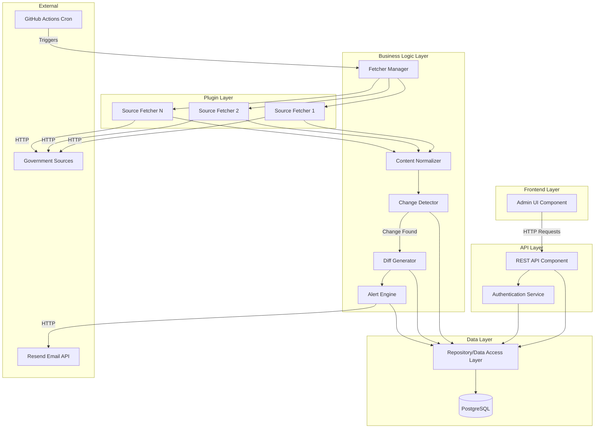

# Components

This section identifies major logical components/services across the fullstack, defining clear boundaries, interfaces, and dependencies.

### Admin UI Component

**Responsibility:** Server-rendered web interface for managing route subscriptions, configuring sources, viewing change history, and manually triggering fetches. Handles all user interactions and presents data from the API.

**Key Interfaces:**
- Renders Jinja2 templates with data from API endpoints
- Handles form submissions and user interactions via JavaScript
- Displays dashboard statistics, route lists, source configurations, and change history
- Provides manual trigger interface for testing source fetchers

**Dependencies:**
- REST API (all data operations)
- Authentication system (login/logout)
- Static assets (CSS via Tailwind, JavaScript for interactions)

**Technology Stack:** Jinja2 templates, Tailwind CSS, vanilla JavaScript, FastAPI static file serving

**Key Files:**
- `admin-ui/templates/` - Jinja2 template files
- `admin-ui/static/` - CSS and JavaScript assets
- FastAPI route handlers that render templates

### REST API Component

**Responsibility:** Provides RESTful API endpoints for all data operations. Handles authentication, request validation, business logic orchestration, and database operations. Serves both the admin UI and potential future API consumers.

**Key Interfaces:**
- REST endpoints: `/api/routes`, `/api/sources`, `/api/changes`, `/api/dashboard`, `/api/sources/{id}/trigger`
- Authentication endpoints: `/auth/login`, `/auth/logout`
- Health check: `/health`
- OpenAPI documentation: `/docs`

**Dependencies:**
- Repository/Data Access Layer (all database operations)
- Authentication Service (JWT token validation)
- Alert Engine (for manual trigger notifications)
- Fetcher Manager (for manual trigger execution)

**Technology Stack:** FastAPI, Pydantic for validation, SQLAlchemy ORM

**Key Files:**
- `api/routes/` - API route handlers
- `api/models/` - Pydantic request/response models
- `api/middleware/` - Authentication and error handling middleware

### Authentication Service

**Responsibility:** Manages admin user authentication, JWT token generation and validation, and session management. Provides secure access control for protected endpoints.

**Key Interfaces:**
- `login(username, password)` - Validates credentials and returns JWT token
- `logout(token)` - Invalidates token
- `validate_token(token)` - Verifies token and returns user info
- `hash_password(password)` - Secure password hashing with bcrypt
- `verify_password(password, hash)` - Password verification

**Dependencies:**
- Repository/Data Access Layer (user credential storage)
- JWT library for token generation/validation

**Technology Stack:** bcrypt for password hashing, python-jose for JWT, FastAPI Security

**Key Files:**
- `api/auth/` - Authentication logic and endpoints
- `api/models/user.py` - User model and password hashing utilities

### Repository/Data Access Layer

**Responsibility:** Abstracts database operations behind a clean interface. Provides methods for CRUD operations on all entities (Source, PolicyVersion, PolicyChange, RouteSubscription, EmailAlert). Implements the Repository pattern to enable testing and future database changes.

**Key Interfaces:**
- `SourceRepository` - CRUD operations for sources
- `PolicyVersionRepository` - Create and query policy versions
- `PolicyChangeRepository` - Create and query policy changes
- `RouteSubscriptionRepository` - CRUD operations for route subscriptions
- `EmailAlertRepository` - Create and query email alerts
- `get_latest_version(source_id)` - Get most recent policy version for a source
- `find_matching_routes(country, visa_type)` - Find route subscriptions matching criteria

**Dependencies:**
- PostgreSQL database (via SQLAlchemy)
- Database connection pool

**Technology Stack:** SQLAlchemy ORM, Alembic for migrations, PostgreSQL

**Key Files:**
- `api/repositories/` - Repository classes for each entity
- `api/models/db/` - SQLAlchemy database models
- `api/database.py` - Database connection and session management

### Fetcher Manager

**Responsibility:** Orchestrates source fetching operations. Discovers and loads source fetcher plugins, manages concurrent fetching, handles errors, and coordinates the fetch pipeline. Provides the plugin registry and execution environment.

**Key Interfaces:**
- `load_fetchers()` - Discovers and loads all fetcher plugins from `fetchers/` directory
- `fetch_source(source_id)` - Executes fetcher for a specific source
- `fetch_all_sources()` - Fetches all active sources concurrently
- `get_fetcher_for_source(source)` - Returns appropriate fetcher plugin for a source
- `register_fetcher(name, fetcher_function)` - Registers a new fetcher plugin

**Dependencies:**
- Source Fetchers (plugin modules)
- Repository/Data Access Layer (source configuration, storing results)
- Content Normalizer (normalizing fetched content)

**Technology Stack:** Python importlib for dynamic loading, asyncio for concurrent fetching

**Key Files:**
- `api/services/fetcher_manager.py` - Fetcher manager implementation
- `fetchers/` - Directory containing source fetcher plugins
- `fetchers/base.py` - Base fetcher interface/abstract class

### Source Fetchers (Plugin System)

**Responsibility:** Individual plugin modules that fetch content from specific government sources. Each fetcher handles one source's specific requirements (HTML scraping, PDF extraction, authentication if needed). Implements a standardized interface for integration with the fetcher manager.

**Key Interfaces:**
- `fetch(url, metadata)` - Standard function signature for all fetchers
  - Input: source URL and metadata (country, visa type, fetch type)
  - Output: `FetchResult` with raw text, content type, fetch timestamp, and metadata

**Dependencies:**
- External government sources (HTTP requests)
- `requests` library for HTTP
- `beautifulsoup4` for HTML parsing
- `pdftotext` or `pdfplumber` for PDF extraction

**Technology Stack:** Python, requests, beautifulsoup4, pdftotext (subprocess)

**Key Files:**
- `fetchers/de_bmi_student.py` - Example: Germany BMI Student visa fetcher
- `fetchers/de_bmi_work.py` - Example: Germany BMI Work visa fetcher
- `fetchers/base.py` - Base fetcher interface and common utilities

**Plugin Interface Example:**
```python
def fetch(url: str, metadata: dict) -> FetchResult:
    # Fetcher-specific implementation
    # Returns: FetchResult(raw_text, content_type, fetched_at, metadata)
    pass
```

### Content Normalizer

**Responsibility:** Normalizes fetched content to enable stable change detection. Strips boilerplate, normalizes whitespace, removes timestamps/logos where possible. Ensures consistent hashing for change detection.

**Key Interfaces:**
- `normalize(raw_text, source_metadata)` - Normalizes text content
  - Input: raw text from fetcher, source metadata for source-specific rules
  - Output: normalized text string ready for hashing

**Dependencies:**
- None (pure function, no external dependencies)

**Technology Stack:** Python string processing, regex for pattern removal

**Key Files:**
- `api/services/normalizer.py` - Normalization logic
- `api/services/normalization_rules.py` - Source-specific normalization rules (if needed)

**Normalization Steps:**
1. Strip HTML tags (if HTML source)
2. Normalize whitespace (multiple spaces → single space)
3. Remove timestamps and dates (pattern-based)
4. Remove logos/watermarks (if detectable)
5. Convert to consistent encoding (UTF-8)
6. Trim leading/trailing whitespace

### Change Detector

**Responsibility:** Detects changes in policy content by comparing SHA256 hashes of consecutive policy versions. Triggers diff generation when changes are detected. Implements deterministic change detection logic.

**Key Interfaces:**
- `detect_change(source_id, new_hash, new_content)` - Compares new hash with previous version
  - Input: source ID, new content hash, new normalized content
  - Output: `ChangeResult` indicating if change detected, with old/new hashes
- `compare_hashes(old_hash, new_hash)` - Simple hash comparison
- `get_previous_version(source_id)` - Retrieves most recent policy version for comparison

**Dependencies:**
- Repository/Data Access Layer (retrieving previous versions, storing change records)
- Hashing utility (SHA256)
- Diff Generator (when change detected)

**Technology Stack:** Python hashlib for SHA256, Repository pattern for data access

**Key Files:**
- `api/services/change_detector.py` - Change detection logic
- `api/utils/hashing.py` - SHA256 hash generation utility

### Diff Generator

**Responsibility:** Generates text diffs showing what changed between two policy versions. Uses Python's `difflib` to create unified diff format. Stores diff text for email alerts and admin interface display.

**Key Interfaces:**
- `generate_diff(old_content, new_content)` - Creates unified diff text
  - Input: old normalized content, new normalized content
  - Output: unified diff string (text format)
- `generate_html_diff(old_content, new_content)` - Creates HTML-formatted diff (optional, for UI)

**Dependencies:**
- Python `difflib` library
- Repository/Data Access Layer (storing diff with PolicyChange record)

**Technology Stack:** Python difflib (standard library)

**Key Files:**
- `api/services/diff_generator.py` - Diff generation logic

### Alert Engine

**Responsibility:** Sends email alerts when policy changes are detected. Matches policy changes to route subscriptions, formats email content, and sends via Resend. Tracks alert delivery for auditability.

**Key Interfaces:**
- `send_change_alert(policy_change_id)` - Sends alert for a specific policy change
  - Finds matching route subscriptions
  - Formats email with route, source, timestamp, diff preview
  - Sends via Resend API
  - Records EmailAlert record
- `find_matching_routes(policy_change)` - Finds route subscriptions that match a policy change
- `format_email_content(change, route)` - Formats email HTML/text content

**Dependencies:**
- Repository/Data Access Layer (finding routes, storing alerts)
- Resend email service (external API)
- Email template system

**Technology Stack:** Resend Python SDK, Jinja2 for email templates

**Key Files:**
- `api/services/alert_engine.py` - Alert sending logic
- `api/templates/emails/` - Email templates (Jinja2)
- `api/integrations/resend.py` - Resend API client

### Scheduler/Background Jobs

**Responsibility:** Triggers daily fetch pipeline execution. Runs as GitHub Actions cron job that calls the fetch pipeline API endpoint or executes pipeline directly. Provides scheduled automation for source monitoring.

**Key Interfaces:**
- GitHub Actions workflow (`.github/workflows/daily-fetch.yml`)
  - Scheduled: daily at configured time (e.g., 2 AM UTC)
  - Executes: fetch pipeline for all active sources
  - Handles: errors, logging, notifications

**Dependencies:**
- Fetcher Manager (orchestrating fetches)
- Change Detector (detecting changes)
- Alert Engine (sending notifications)

**Technology Stack:** GitHub Actions, Python script for pipeline execution

**Key Files:**
- `.github/workflows/daily-fetch.yml` - GitHub Actions workflow
- `scripts/run_fetch_pipeline.py` - Pipeline execution script

### Component Interaction Diagram



---

