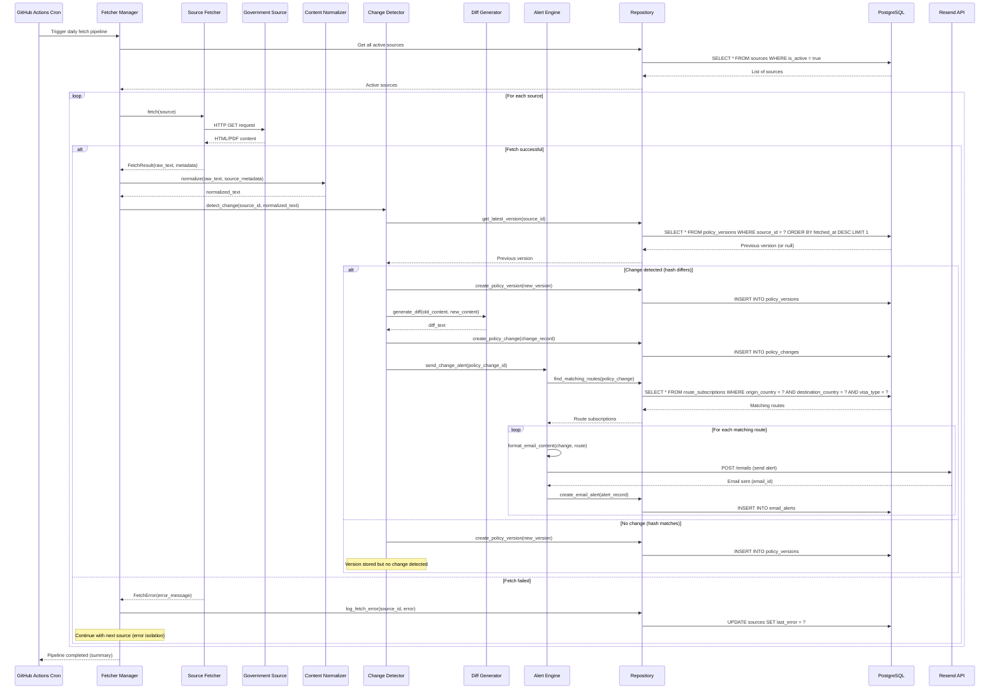
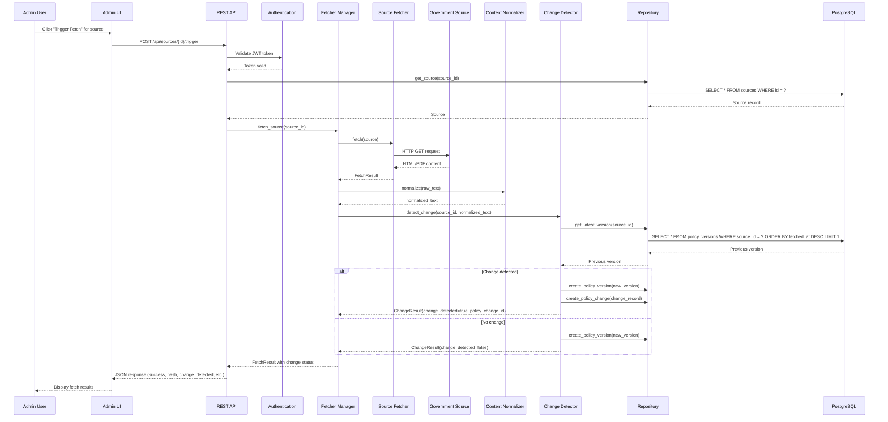
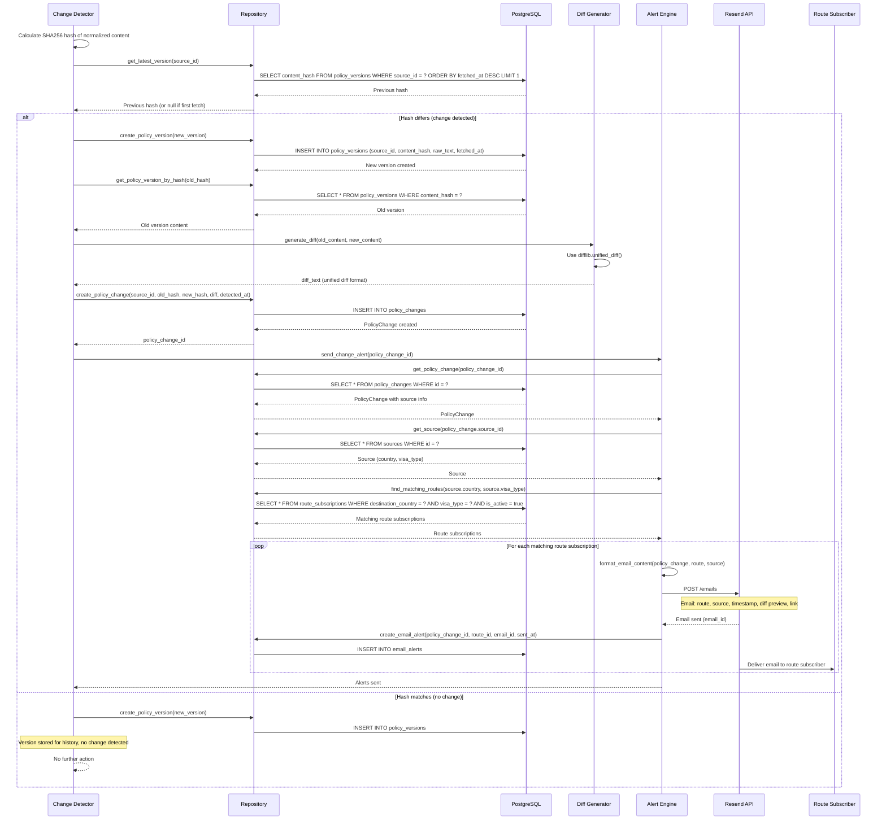
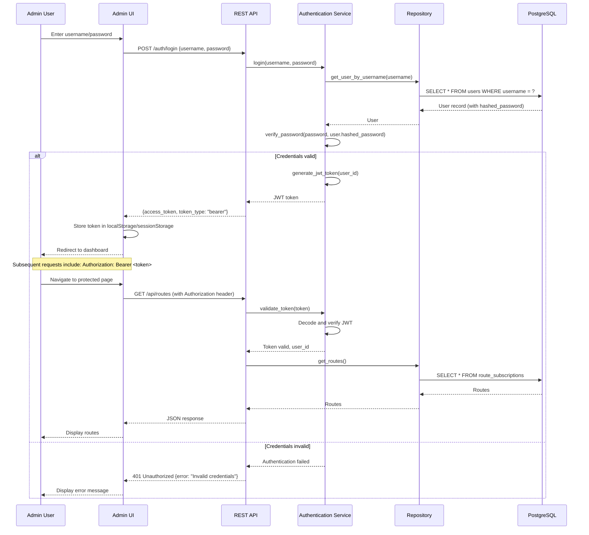
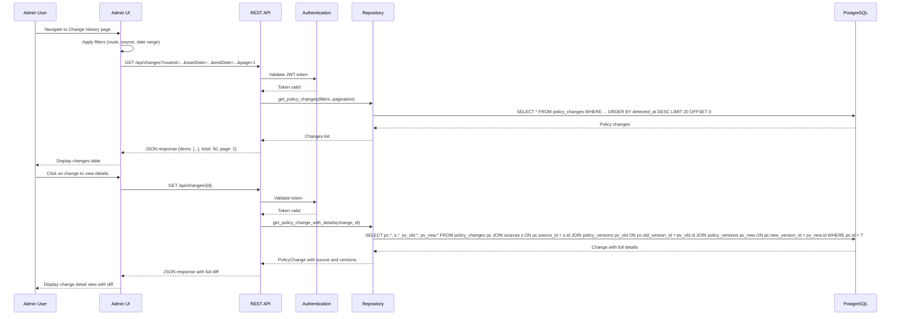

# Core Workflows

This section illustrates key system workflows using sequence diagrams, showing component interactions including external APIs, error handling paths, and async operations.

### Workflow 1: Daily Fetch Pipeline (Automated)

**Description:** The primary automated workflow that runs daily via GitHub Actions cron. Fetches all active sources, normalizes content, detects changes, and sends email alerts when changes are detected.

**Key Points:**
- Error isolation: One source failure doesn't stop the pipeline
- Immutable versions: New PolicyVersion created even if no change detected
- Change detection: Hash comparison determines if change occurred
- Alert matching: Routes matched by country and visa type
- Async operations: All database operations are synchronous (can be made async later)

### Workflow 2: Manual Source Fetch (Testing/Debugging)

**Description:** Admin-initiated workflow for manually triggering a source fetch via the admin interface. Used for testing source configurations and debugging fetch issues.

**Key Points:**
- Authentication required for manual trigger
- Same pipeline as automated fetch (code reuse)
- Results returned immediately to admin
- Useful for testing source configurations before enabling automated checks

### Workflow 3: Policy Change Detection and Alert Flow

**Description:** Detailed flow showing what happens when a policy change is detected, from hash comparison through email alert delivery.

**Key Points:**
- Hash comparison is the primary change detection mechanism
- Diff generation only occurs when change is detected (efficiency)
- Route matching uses country and visa type (not stored foreign keys)
- Email alerts sent to all matching route subscriptions
- Each alert delivery is tracked in EmailAlert table

### Workflow 4: Admin Login and Session Management

**Description:** User authentication flow for admin access to the interface and API.

**Key Points:**
- JWT tokens for stateless authentication
- Password hashing with bcrypt
- Token stored client-side (localStorage/sessionStorage)
- All protected endpoints validate token
- Token expiration (24 hours) handled by JWT validation

### Workflow 5: View Change History (Admin Interface)

**Description:** Admin viewing policy changes with filtering and detail view.

**Key Points:**
- Filtering and pagination for large change lists
- Detailed view includes full diff and source information
- Efficient database queries with JOINs for related data
- Authentication required for all change history access

### Error Handling Patterns

All workflows include error handling:

1. **Fetch Errors:** Isolated per source, logged, pipeline continues
2. **Database Errors:** Transaction rollback, error logged, user-friendly error message
3. **Email Send Errors:** Retry with exponential backoff, logged, doesn't block change detection
4. **Authentication Errors:** 401 response, clear error message, no token exposure
5. **Validation Errors:** 400 response with field-specific error messages

**Retry Logic:**
- Source fetches: 2-3 retries with exponential backoff (1s, 2s, 4s delays)
- Email sends: 2-3 retries with exponential backoff
- Database operations: No retries (fail fast, log error)

---

