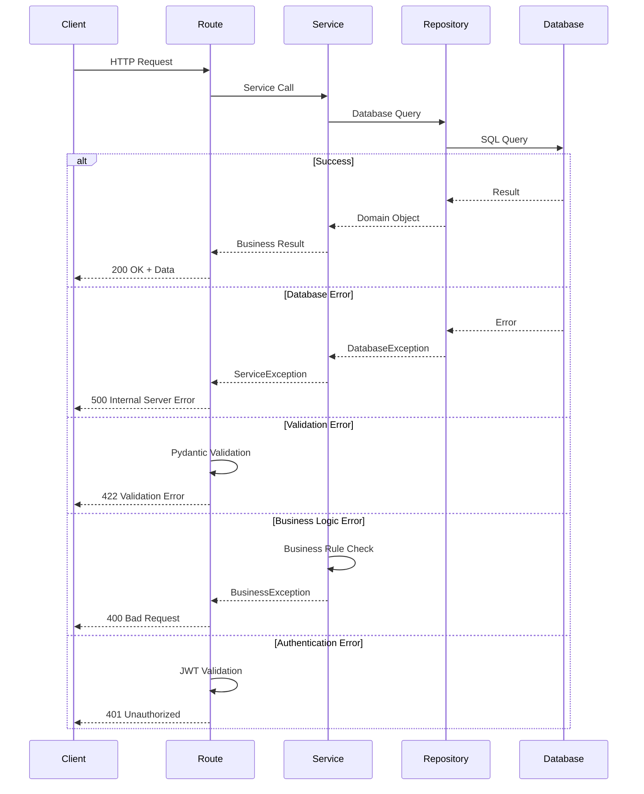

# Error Handling Strategy

This section defines unified error handling across frontend and backend, ensuring consistent error responses and proper error propagation.

### Error Flow



### Error Response Format

**Standard Error Response:**
```typescript
interface ApiError {
  error: {
    code: string;           // Machine-readable error code
    message: string;        // Human-readable error message
    details?: Record<string, any>;  // Additional error details
    timestamp: string;      // ISO 8601 timestamp
    requestId: string;      // Unique request ID for tracing
  };
}
```

**Example Error Response:**
```json
{
  "error": {
    "code": "VALIDATION_ERROR",
    "message": "Invalid country code provided",
    "details": {
      "field": "originCountry",
      "value": "INVALID",
      "expected": "2-letter ISO country code"
    },
    "timestamp": "2024-01-15T10:30:00Z",
    "requestId": "req_abc123"
  }
}
```

### Error Codes

**Standard Error Codes:**
- `VALIDATION_ERROR`: Request validation failed (422)
- `AUTHENTICATION_ERROR`: Invalid or missing authentication (401)
- `AUTHORIZATION_ERROR`: Insufficient permissions (403)
- `NOT_FOUND`: Resource not found (404)
- `CONFLICT`: Resource conflict (e.g., duplicate) (409)
- `INTERNAL_ERROR`: Server error (500)
- `SERVICE_UNAVAILABLE`: External service unavailable (503)
- `RATE_LIMIT_EXCEEDED`: Too many requests (429)

**Custom Error Codes:**
- `SOURCE_FETCH_FAILED`: Failed to fetch source content
- `CHANGE_DETECTION_ERROR`: Error during change detection
- `EMAIL_SEND_FAILED`: Failed to send email alert
- `INVALID_HASH`: Content hash validation failed

### Frontend Error Handling

**Error Display:**
- Show user-friendly error messages
- Display validation errors inline with form fields
- Show generic error for unexpected errors
- Log detailed errors to console (development only)

**Error Handling Pattern:**
```javascript
// admin-ui/static/js/api-client.js
async function fetchRoutes() {
  try {
    const response = await fetch('/api/routes', {
      headers: {
        'Authorization': `Bearer ${getToken()}`
      }
    });
    
    if (!response.ok) {
      const error = await response.json();
      handleApiError(error);
      return;
    }
    
    const data = await response.json();
    return data.items;
  } catch (error) {
    handleNetworkError(error);
  }
}

function handleApiError(error) {
  switch (error.error.code) {
    case 'AUTHENTICATION_ERROR':
      // Redirect to login
      window.location.href = '/login';
      break;
    case 'VALIDATION_ERROR':
      // Show validation errors
      displayValidationErrors(error.error.details);
      break;
    default:
      // Show generic error
      showErrorMessage(error.error.message);
  }
}
```

**Template Error Handling:**
```jinja2
{# admin-ui/templates/routes/list.html #}

  <div class="bg-red-50 border border-red-200 rounded p-4 mb-4">
    <p class="text-red-800">{{ error.message }}</p>
    
      <ul class="mt-2 text-sm text-red-600">
        
          <li>{{ field }}: {{ message }}</li>
        
      </ul>
    
  </div>

```

### Backend Error Handling

**Custom Exception Classes:**
```python
# api/exceptions.py
from fastapi import HTTPException, status

class BaseAPIException(HTTPException):
    """Base exception for API errors."""
    def __init__(
        self,
        status_code: int,
        code: str,
        message: str,
        details: dict = None
    ):
        super().__init__(status_code=status_code, detail={
            "code": code,
            "message": message,
            "details": details or {}
        })
        self.code = code
        self.message = message
        self.details = details or {}

class ValidationError(BaseAPIException):
    """Validation error (422)."""
    def __init__(self, message: str, details: dict = None):
        super().__init__(
            status_code=status.HTTP_422_UNPROCESSABLE_ENTITY,
            code="VALIDATION_ERROR",
            message=message,
            details=details
        )

class NotFoundError(BaseAPIException):
    """Resource not found (404)."""
    def __init__(self, resource: str, resource_id: str):
        super().__init__(
            status_code=status.HTTP_404_NOT_FOUND,
            code="NOT_FOUND",
            message=f"{resource} not found",
            details={"resource": resource, "id": resource_id}
        )

class AuthenticationError(BaseAPIException):
    """Authentication error (401)."""
    def __init__(self, message: str = "Invalid authentication"):
        super().__init__(
            status_code=status.HTTP_401_UNAUTHORIZED,
            code="AUTHENTICATION_ERROR",
            message=message
        )
```

**Global Exception Handler:**
```python
# api/main.py
from fastapi import FastAPI, Request, status
from fastapi.responses import JSONResponse
from api.exceptions import BaseAPIException
import logging

app = FastAPI()
logger = logging.getLogger(__name__)

@app.exception_handler(BaseAPIException)
async def api_exception_handler(request: Request, exc: BaseAPIException):
    """Handle custom API exceptions."""
    return JSONResponse(
        status_code=exc.status_code,
        content={
            "error": {
                "code": exc.code,
                "message": exc.message,
                "details": exc.details,
                "timestamp": datetime.utcnow().isoformat(),
                "requestId": request.state.request_id
            }
        }
    )

@app.exception_handler(Exception)
async def general_exception_handler(request: Request, exc: Exception):
    """Handle unexpected exceptions."""
    logger.exception("Unhandled exception", exc_info=exc)
    return JSONResponse(
        status_code=status.HTTP_500_INTERNAL_SERVER_ERROR,
        content={
            "error": {
                "code": "INTERNAL_ERROR",
                "message": "An unexpected error occurred",
                "details": {},
                "timestamp": datetime.utcnow().isoformat(),
                "requestId": request.state.request_id
            }
        }
    )
```

**Service Layer Error Handling:**
```python
# api/services/change_detector.py
from api.exceptions import NotFoundError, ValidationError

async def detect_change(
    source_id: str,
    new_hash: str,
    new_content: str
) -> ChangeDetectionResult:
    """Detect policy changes."""
    try:
        # Validate inputs
        if not source_id:
            raise ValidationError("source_id is required")
        
        # Get previous version
        previous_version = await repository.get_latest_version(source_id)
        if not previous_version:
            # First check, no previous version
            return ChangeDetectionResult(change_detected=False)
        
        # Compare hashes
        if previous_version.content_hash == new_hash:
            return ChangeDetectionResult(change_detected=False)
        
        # Change detected
        return ChangeDetectionResult(
            change_detected=True,
            old_hash=previous_version.content_hash,
            new_hash=new_hash
        )
    except ValueError as e:
        raise ValidationError(str(e))
    except Exception as e:
        logger.exception(f"Error detecting change for source {source_id}")
        raise
```

**Repository Layer Error Handling:**
```python
# api/repositories/source_repository.py
from sqlalchemy.exc import IntegrityError
from api.exceptions import NotFoundError, ConflictError

async def get_by_id(self, source_id: str) -> Source:
    """Get source by ID."""
    result = await self.session.get(Source, source_id)
    if not result:
        raise NotFoundError("Source", source_id)
    return result

async def create(self, source_data: dict) -> Source:
    """Create new source."""
    try:
        source = Source(**source_data)
        self.session.add(source)
        await self.session.commit()
        return source
    except IntegrityError as e:
        await self.session.rollback()
        if "unique constraint" in str(e).lower():
            raise ConflictError("Source with this configuration already exists")
        raise
```

### Error Logging

**Logging Strategy:**
- Log all errors with appropriate log levels
- Include request context (request ID, user ID, etc.)
- Don't log sensitive information (passwords, tokens)
- Use structured logging for better searchability

**Example:**
```python
import logging

logger = logging.getLogger(__name__)

try:
    result = await service.detect_change(source_id, hash, content)
except ValidationError as e:
    logger.warning(f"Validation error: {e.message}", extra={
        "source_id": source_id,
        "error_code": e.code
    })
    raise
except Exception as e:
    logger.error(f"Unexpected error in change detection", exc_info=True, extra={
        "source_id": source_id,
        "request_id": request.state.request_id
    })
    raise
```

### Error Recovery

**Retry Strategy:**
- Retry transient errors (network, external API)
- Exponential backoff for retries
- Max 3 retries for external API calls
- No retry for validation or authentication errors

**Example:**
```python
import asyncio
from tenacity import retry, stop_after_attempt, wait_exponential

@retry(
    stop=stop_after_attempt(3),
    wait=wait_exponential(multiplier=1, min=2, max=10)
)
async def fetch_source_with_retry(url: str) -> str:
    """Fetch source with automatic retry."""
    try:
        response = await httpx.get(url, timeout=30)
        response.raise_for_status()
        return response.text
    except httpx.HTTPError as e:
        logger.warning(f"Failed to fetch {url}: {e}")
        raise

---

## Monitoring and Observability

This section defines the monitoring strategy for the fullstack application, ensuring visibility into system health, performance, and errors.

### Monitoring Stack

**Frontend Monitoring:**
- **MVP:** Browser console logging for development
- **Production:** Railway logs for server-side rendering errors
- **Future:** Add client-side error tracking (Sentry, LogRocket) if needed

**Backend Monitoring:**
- **Logging:** Python `logging` module with structured logs
- **Log Aggregation:** Railway logs dashboard
- **Error Tracking:** Python exception logging with stack traces
- **Future:** Add APM tool (Sentry, DataDog) for production monitoring

**Error Tracking:**
- **MVP:** Python logging to Railway logs
- **Error Alerts:** Email alerts for critical errors (future enhancement)
- **Future:** Sentry for error tracking and alerting

**Performance Monitoring:**
- **MVP:** Railway metrics dashboard (CPU, memory, request rate)
- **Application Metrics:** Custom logging for key operations
- **Future:** Add APM tool for detailed performance metrics

### Key Metrics

#### Frontend Metrics

**Core Web Vitals:**
- **LCP (Largest Contentful Paint):** Target < 2.5s
- **FID (First Input Delay):** Target < 100ms
- **CLS (Cumulative Layout Shift):** Target < 0.1
- **Measurement:** Browser DevTools, Lighthouse (manual)

**JavaScript Errors:**
- **Tracking:** Browser console errors logged
- **Alerting:** Not implemented in MVP
- **Future:** Sentry for client-side error tracking

**API Response Times:**
- **Tracking:** Server-side logging of API response times
- **Target:** < 300ms (p95)
- **Measurement:** FastAPI middleware for request timing

**User Interactions:**
- **Tracking:** Not implemented in MVP (simple admin interface)
- **Future:** Add analytics if user-facing features added

#### Backend Metrics

**Request Rate:**
- **Metric:** Requests per minute/hour
- **Tracking:** Railway metrics dashboard
- **Alerting:** Not implemented in MVP
- **Target:** Monitor for unusual spikes

**Error Rate:**
- **Metric:** 4xx and 5xx errors per minute
- **Tracking:** Railway logs, custom error counters
- **Alerting:** Email alert if error rate > 5% (future)
- **Target:** < 1% error rate

**Response Time:**
- **Metric:** p50, p95, p99 response times
- **Tracking:** FastAPI middleware, custom logging
- **Target:** p95 < 300ms, p99 < 500ms
- **Measurement:** Request start/end timestamps

**Database Query Performance:**
- **Metric:** Query execution time
- **Tracking:** SQLAlchemy query logging (development)
- **Slow Query Threshold:** > 500ms
- **Optimization:** Use `EXPLAIN ANALYZE` for slow queries

**Source Fetch Performance:**
- **Metric:** Fetch duration per source
- **Tracking:** Custom logging in FetcherManager
- **Target:** < 30 seconds per source
- **Alerting:** Log warning if fetch > 60 seconds

**Change Detection Performance:**
- **Metric:** Change detection duration
- **Tracking:** Custom logging in ChangeDetector
- **Target:** < 1 second per source
- **Measurement:** Hash generation + comparison time

**Email Sending Performance:**
- **Metric:** Email send duration
- **Tracking:** Custom logging in AlertEngine
- **Target:** < 2 seconds per email
- **Alerting:** Log error if send fails

### Logging Strategy

**Log Levels:**
- **DEBUG:** Detailed information for debugging (development only)
- **INFO:** General informational messages (source fetched, change detected)
- **WARNING:** Warning messages (fetch timeout, retry)
- **ERROR:** Error messages (fetch failed, email send failed)
- **CRITICAL:** Critical errors (database connection lost, system failure)

**Structured Logging:**
```python
import logging
import json
from datetime import datetime

logger = logging.getLogger(__name__)

