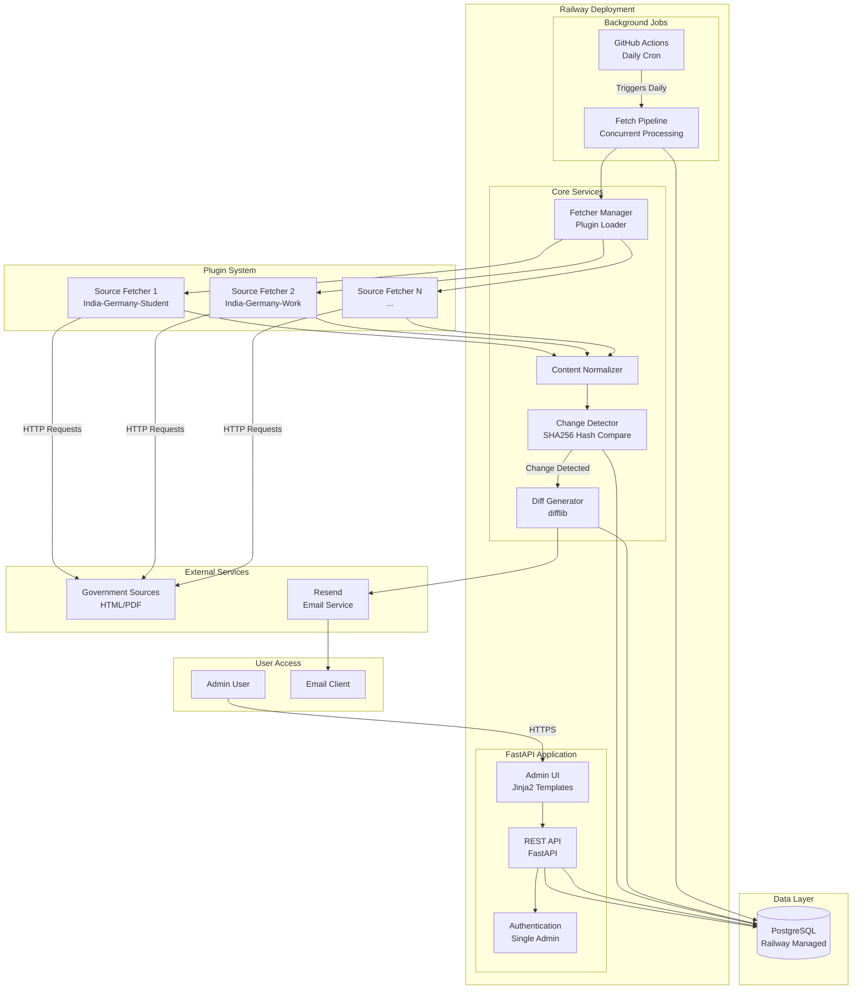

# High Level Architecture

### Technical Summary

Policy Aggregator is a monolithic Python application built with FastAPI that combines a REST API backend and server-rendered admin interface (Jinja2 templates) in a single deployable unit. The architecture follows a plugin-based design where source fetchers are modular Python functions that can be added without modifying core pipeline code. The system uses PostgreSQL for versioned policy storage with immutable history, SHA256 hashing for deterministic change detection, and Python's `difflib` for generating text diffs. Background jobs run via GitHub Actions cron (daily checks) that trigger the fetch pipeline, which processes sources concurrently, normalizes content, detects changes through hash comparison, and sends email alerts via Resend when changes are detected. The entire system is deployed to Railway with integrated PostgreSQL, keeping infrastructure costs under €50/month while maintaining the flexibility to scale horizontally or add advanced features (AI summarization, semantic diffs) without core data model changes.

### Platform and Infrastructure Choice

**Platform:** Railway

**Key Services:**
- Railway Application Hosting (FastAPI monolith)
- Railway PostgreSQL Database (integrated, managed)
- GitHub Actions (scheduled cron jobs for daily fetches)
- Resend (transactional email service)

**Deployment Host and Regions:** Railway (EU region recommended for GDPR compliance, or US East for lower latency)

**Rationale and Trade-offs:**

**Option 1: Railway (Selected)**
- **Pros:** Integrated PostgreSQL, simple deployment, good free tier, easy scaling, built-in environment variables, automatic HTTPS
- **Cons:** Less control than VPS, vendor lock-in
- **Cost:** ~€10-20/month for hosting + database (within budget)
- **Best for:** Rapid MVP deployment with minimal DevOps overhead

**Option 2: Vercel + Supabase**
- **Pros:** Excellent for Next.js/React apps, Supabase has great DX
- **Cons:** Not ideal for Python monolith, requires separate Supabase setup, more complex deployment
- **Cost:** ~€15-25/month
- **Best for:** Modern frontend-heavy applications (not our use case)

**Option 3: AWS Full Stack (Lambda + RDS + SES)**
- **Pros:** Enterprise-grade, highly scalable, very flexible
- **Cons:** Complex setup, steep learning curve, overkill for MVP, higher operational overhead
- **Cost:** ~€20-40/month (can be optimized but requires expertise)
- **Best for:** Enterprise applications with dedicated DevOps team

**Decision:** Railway provides the optimal balance of simplicity, cost-effectiveness, and integrated services for our MVP. The monolith deployment model aligns with our architecture, and the integrated PostgreSQL eliminates database connection complexity. GitHub Actions for cron jobs keeps scheduling free and simple, while Resend provides reliable email delivery with a generous free tier.

### Repository Structure

**Structure:** Monorepo

**Monorepo Tool:** None (simple directory structure, no tooling needed for MVP)

**Package Organization:**
```
policy-aggregator/
├── fetchers/          # Plugin-based source fetchers (one Python file per source)
├── api/               # FastAPI application (routes, models, services)
├── admin-ui/          # Jinja2 templates and static assets
├── scripts/           # Utility scripts (migrations, one-off tasks)
├── tests/             # Unit and integration tests
├── docs/              # Documentation (PRD, architecture, etc.)
├── requirements.txt   # Python dependencies
├── .env.example       # Environment variable template
└── README.md          # Project overview and setup
```

**Rationale:** 
- Single repository simplifies versioning, deployment, and development workflow
- Clear separation of concerns (fetchers, API, UI) without microservices complexity
- Shared code (models, utilities) can be imported across modules
- No monorepo tooling needed initially - simple directory structure is sufficient
- Can migrate to Nx/Turborepo later if complexity grows

### High Level Architecture Diagram



### Architectural Patterns

- **Monolithic Architecture:** Single deployable application containing API, admin UI, and business logic - _Rationale:_ Simplifies deployment, reduces operational overhead, and keeps costs low for MVP. All components share the same database and can be scaled together. Avoids microservices complexity that would slow down development.

- **Plugin-Based Source Fetchers:** Each source fetcher is a separate Python module with a standardized interface - _Rationale:_ Enables adding new sources without modifying core pipeline code (NFR12). New sources are added by creating a new Python file in `fetchers/` directory. The fetcher manager dynamically loads and executes fetchers, making the system extensible without architectural changes.

- **Versioned Immutable Storage:** Policy documents are stored with version history, never overwritten - _Rationale:_ Provides complete audit trail (NFR4) and enables future features like change history analysis. Each policy version has a unique hash, timestamp, and content, ensuring we can always reconstruct what changed and when.

- **Deterministic Change Detection:** SHA256 hash comparison for change detection - _Rationale:_ Zero false positives (NFR3) and no AI dependencies in MVP (NFR6). Hash comparison is fast, reliable, and deterministic. Normalization before hashing ensures consistent comparison even if source formatting changes slightly.

- **Server-Side Rendering (SSR):** Jinja2 templates with FastAPI for admin UI - _Rationale:_ Simpler than SPA for MVP, faster initial load, no JavaScript framework overhead. Template-based approach aligns with "boring is good" principle and reduces complexity. Can migrate to React/Next.js later if needed.

- **Repository Pattern (Data Access):** Abstract data access logic behind service layer - _Rationale:_ Enables testing with mock repositories, provides flexibility to change database implementation, and keeps business logic separate from data access. Makes it easier to add caching or change ORM later.

- **Background Job Pattern:** Scheduled tasks (GitHub Actions cron) trigger fetch pipeline - _Rationale:_ Decouples scheduled work from web application, allows independent scaling, and uses free GitHub Actions instead of paid cron services. Pipeline runs asynchronously and doesn't block web requests.

- **Error Isolation:** Each source fetcher runs independently with error handling - _Rationale:_ One failing source doesn't crash the entire pipeline (FR17). Errors are logged, retried with exponential backoff, and admin is notified of persistent failures. System continues processing other sources even if one fails.

---

